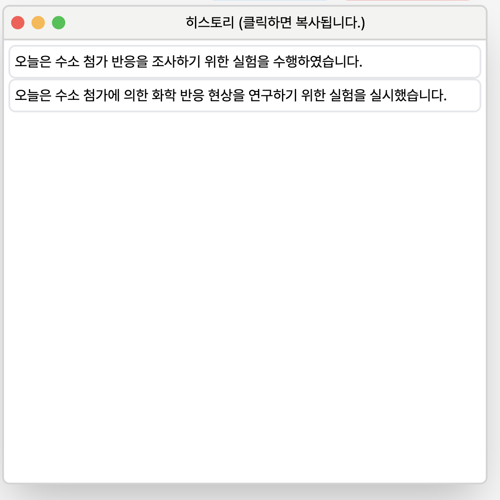
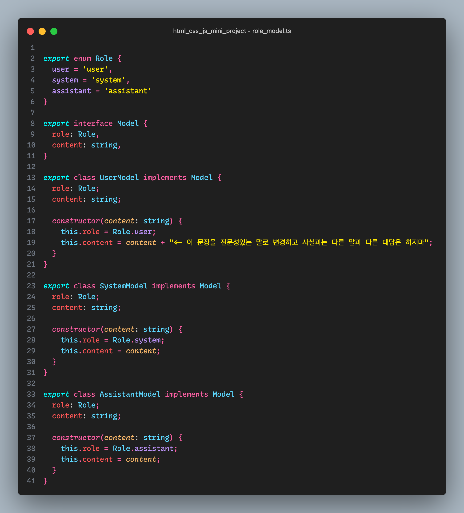
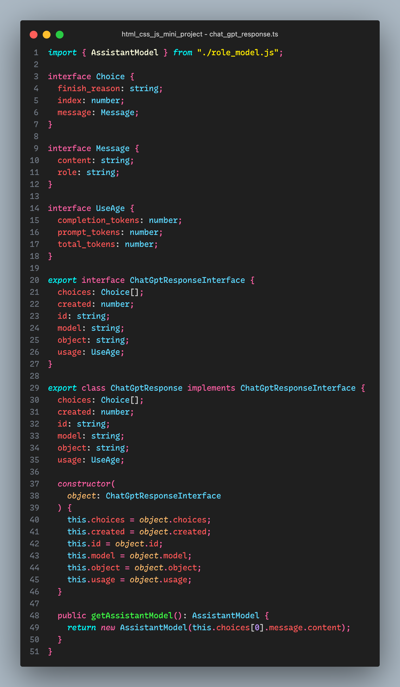
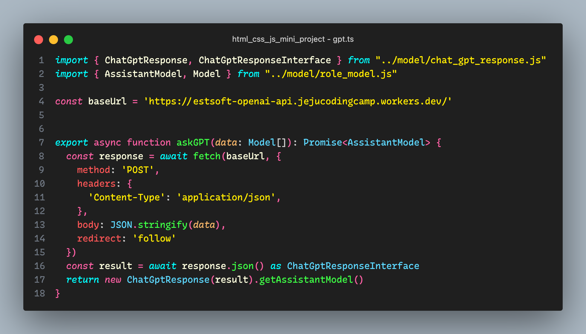
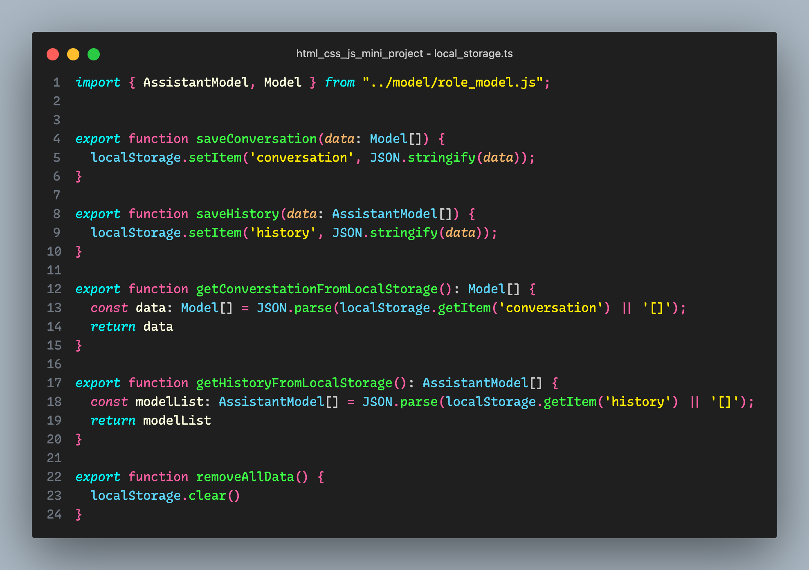
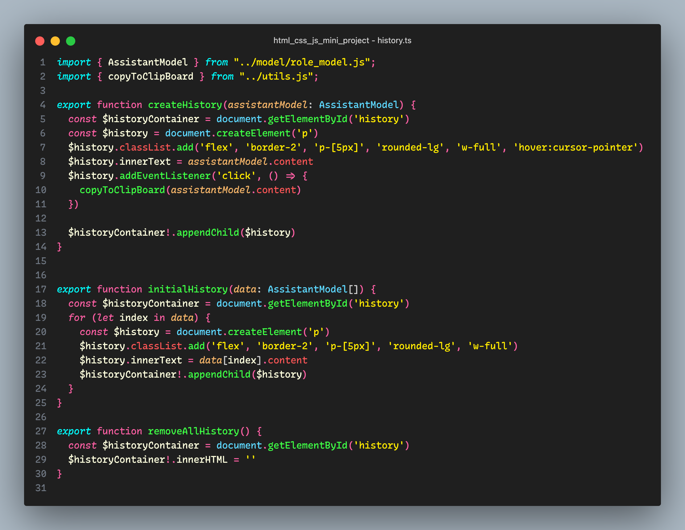

<h1 style="display: flex; justify-content: center; font-size: 50px"> 글마루 </h1>

글마루는 '글'과 '마루'(= 넓은 공간)의 조합으로, 글자수가 많아지고, 전문성을 추가해주는 서비스임을 나타냅니다.
이 서비스는 기획하게 된 이유는,점차 사람들의 어휘력이 낮아지고 작문 할 일이 적어서, 글을 쓰는 데 어려움이 있는 분들이 (저 포함) 많다는 말을 들어 개발한 서비스입니다.

<br>

<p style="font-size: 30px"> [목차] </p>

1. 핵심 기능
2. 변환기 사용법
3. 히스토리
4. 대화 초기화, 지우기
5. 개발 관련

<br>

# [핵심 기능]

이 서비스의 핵심 기능은 다음과 같습니다.

1. **전문성 있는 글로 변환**해줍니다.
   - 전문성이라 함은, 보고서 에세이, 논문 등 공식적인 자리에 사용하기 적합한 어휘를 의미합니다.
2. 기존의 문맥에 읽고, 글을 작성해줍니다.
3. 새로고침, 사이트에서 나가도 모든 데이터를 저장하기에 다시 접속하면 대화를 이어서 할수 있습니다.
4. 변환 결과 또는 히스토리에 저장된 결과를 클릭 하나로 간편하게 클립보드에 복사할 수 있습니다.
5. 모바일 화면에서도 사용할수 있게 모바일 환경에도 대응합니다.

<br>

# [변환기 사용법]

1. 변환기에 변환하고자 하는 문장, 문단을 작성합니다.
2. 변환 버튼을 클릭한 후 변환이 될때까지 기다려줍니다. (문장, 문단이 길수록 변환하는게 시간이 걸릴수 있습니다.)


3. 변환된 글을 확인하고 복사 버튼을 눌러 복사하거나, 결과가 맘에 들지 않을 경우, 변환 버튼을 눌러 다시 변환을 시도해볼수 있습니다.

<br>

# [히스토리]

변환하여 나온 결과들은 결과 창뿐만 아니라, 히스토리 창에도 표시가 됩니다.



변환된 글이 맘에 들지 않아 다시 변환해도 히스토리에 저장이 되므로, 이전 변환 기록이 필요하면 클릭해서 복사할 수 있습니다.

<br>

# [대화 초기화, 지우기]


글마루는 이전에 변환된 글을 모두 저장하기 때문에, 이전에 변환된 글의 문맥을 유추하여 새롭게 변환 된 글에 영향을 줄 수 있습니다. 이럴때는 `대화 초기화` 버튼을 클릭하시면 이전에 대화한 기록이 삭제 되기에 이전에 변환된 글과 지금 변환하려는 글이 서로 연관성이 떨어진다면 `대화 초기화`를 하여 영향을 받지 않게 해주시는게 좋습니다.

_**대화를 초기화하면 대화 기록도 삭제되기 때문에 주의 해주세요!**_

`대화 기록 지우기`는 이전에 변환한 글을 모두 삭제합니다. 하지만 대화 내용은 삭제 하지 않아 문맥 유추에 영향을 미치는 것이 없습니다.

<br>

# [개발]

### 1. TypeScript 사용 이유

JavaScript는 타입에서 자유롭기 때문에, 타입 변환을 방지하고 버그를 최소화하고, 타입을 알려줌으로써 코드를 좀더 안정적으로 작성하고, `enum`, `interface` 타입을 사용하기 위해 타입스크립트를 사용했습니다.

### 2. Tailwind 사용 이유

웹 개발을 할때 로직뿐만 아니라 CSS에도 많은 시간을 할당합니다. UI 구현에 많은 시간이 걸리기에 이를 조금이라도 덜고 또 모바일 환경에 쉽게 대응하고, 로직에 집중하기 위해 Tailwind를 사용했습니다.

### 3. 폴더 구조

현재 폴더 구조는 기능에 따라 분류하였습니다.

- `conversation` - 대화 내용 관련된 기능
- `dialog` - 다이얼로그를 조작하고 관리하는 기능
- `gpt` - GPT에게 요청하는 기능
- `dist` - `js`로 컴파일된 파일
- `history` - 히스토리 관련 기능
- `local_storage` - 로컬 스토리지를 조작, 관리하는 기능
- `model` - 프로젝트 내에서 쓰이는 모델들의 정의

<!-- ### 4. 모델

데이터를 보다 효율적으로 활용하기 위해 다음과 같은 모델들을 정의 했습니다.

다음은, ChatGPT에게 요청하기 위해 정의한 모델들입니다.

```typescript
// role
export enum Role {
  user = 'user',
  system = 'system',
  assistant = 'assistant',
}

// { "role": ~, "content": ~ } 인터페이스
export interface Model {
  role: Role;
  content: string;
}

// Model의 구현체
// { "role": "user", "content": ~ } 형태
export class UserModel implements Model {
  role: Role = Role.user;
  content: string;

  constructor(content: string) {
    this.content = content + '<- 이 문장을 전문성있는 말로 변경하고 사실과는 다른 말과 다른 대답은 하지마';
  }
}

// Model의 구현체
// { "role": "system", "content": ~ } 형태
export class SystemModel implements Model {
  role: Role = Role.system;
  content: string;

  constructor(content: string) {
    this.content = content;
  }
}

// Model의 구현체
// { "role": "assistant", "content": ~ } 형태
export class AssistantModel implements Model {
  role: Role = Role.assistant;
  content: string;

  constructor(content: string) {
    this.content = content;
  }
}
``` -->

<!-- - `Model` - `{ role: ~ , content: ~ }`의 인터페이스
- `UserModel` , `SystemModel`, `AssistantModel` - `Model`의 구현체
- `ChatGptResponseInterface` - `JSON.stringify`로 json을 파싱하면 나오는 `object` 형태가 되기에 활용하기 위해 모델로 변환하기 위한 인터페이스
- `ChatGptResponse` - `ChatGptResponseInterface`의 구현체 -->

<!-- <br> -->

<!-- ## 개발 내용

사용된 기술

1. 타입 스크립트
2. tailwindcss

이 서비스를 개발할때, 그냥 JS가 아닌 TS를 사용해 개발을 했습니다. 타입 명시를 하지 않아도 개발을 할수 있는데 JS의 장점이지만, 정적 언어만을 사용해 왔기에 타입 명시를 할수 있는 TS를 사용해 개발을 했습니다. 또한 tailwindcss는 각 태그에 스타일을 간편하게 적용하기 위해 사용했습니다.

## 모델 지정하기

본격적으로 개발을 하기 위해서 프로젝트내에서 사용할 모델들을 정의했습니다.

정의한 모델들은 다음과 같습니다.

- Role
- UserModel
- SystemModel
- AssistantModel
- ChatGptResponseInterface
- ChatGptResponse

## Role, UserModel, SystemModel, AssistantModel

chat gpt에게 요청하기 위한 모델을 보니 `{ "role" : ~ , "content" : ~ }` 형태로 되어 있고, `role`으로 `system`, `user`, `assistant`으로 나누는 것을 확인하고 이걸 일반화, 클래스로 만들기로 했습니다.



- Role

`Role`은 `enum`으로 지정하고 각 User,System,Asistant 모델의 베이스인 `Model` 인터페이스를 선언하고 각 모델은 Model의 구현체 class로 정의했습니다.

_\*`UserModel`만은 생성할때 매개변수로 들어오는 값에 추가 조건을 추가했습니다._

- Model

`Model`은 User, System, Assistant의 인터페이스로 `role`과 `content`을 구현해야합니다.

- `UserModel`, `SystemModel`, `AssistantModel`
  각각 모델들은 `Model`의 구현체 클래스로, 각각의 `role`은 고정되어 있어, 생성할때 `content`만 매개변수로 받게끔 설계했습니다.

모든 모델들을 `export`하여 다른 곳에서 사용할수 있게 했습니다.

## ChatGptResponseInterface, ChatGptResponse



OpenAPI의 문서를 확인하고 Response 모델을 정의했습니다. `JSON.stringify`로 json을 파싱하면 `object` 형태가 되기에 이를 `ChatGptResponseInterface`으로 지정할수 있는 인터페이스를 지정하고, 이의 구현체인 `ChatGptResponse`를 정의했습니다.
그냥 인터페이스로만으로 충분하지만, `AssistantModel`을 추출하기 위해 메소드를 추가 하기 위해 class 구현체를 정의했습니다.

`ChatGptResponseInterface`와 `ChatGptResponse`이 외는 다른곳에서 사용할 일이 없기 때문에 그 둘만 `export`했습니다.

## ChatGpt에 요청하기



ChatGpt에게 요청하는 부분을 따로 분리하여 함수로 정의 했습니다.

매개변수로는 `Model[]`으로 지정하여 `UserModel,SystemModel,AssistandModel`을 전부 보낼수 있게 선언했습니다. 그리고 리턴 타입은 `AssistantModel`으로 정의했습니다.

## Local Storage

대화 내용, 및 변환된 글 데이터가 휘발되지 않도록, `local storage`에 저장했습니다.



- `saveConversationToLocalStorage()` 함수는 chatGPT와 나눈 데이터들을 저장하기 위해 쓰이는 함수입니다.

- `saveHistoryToLocalStorage()` 함수는 `history` 데이터를 저장하기 위해 쓰이는 함수입니다.

- `getConversationFromLocalStorage()` 함수는 `local storage`에서 conversation 데이터를 읽어오는 함수입니다.

- `getHistoryFromLocalStorage()` 함수는 `local storage`에서 history 데이터를 읽어오는 함수입니다.

- `removeAllData()` 함수는 초기화 버튼을 눌렀을때 `local storage`에 저장된 모든 데이터를 삭제하는 사용되는 함수입니다.

## History

변환된 글을 저장하고 화면에 표시하기 위한 history 코드입니다.



- `initialHistory()` 함수를 통해 사이트에 접속하거나, 새로고침을 했을때, local storage에서 history 데이터를 가져와 화면에 표시합니다.

- `createHistory()` 함수는 `AssistantModel`을 화면에 표시할 수 있도록 html 태그를 생성해주는 함수입니다.

- `removeHistory()` 함수는 지우기 버튼을 클릭했을때 화면에 표시된 history 태그들을 전부 삭제하기 위한 함수입니다. -->
