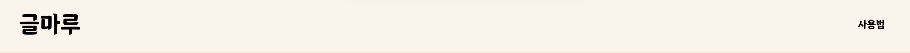

<h1 style="display: flex; justify-content: center; font-size: 50px"> 글마루 </h1>

글마루는 '글'과 '마루'(= 넓은 공간)의 조합으로, 글자수가 많아지고, 전문성을 추가해주는 서비스임을 나타냅니다.
이 서비스는 기획하게 된 이유는,점차 사람들의 어휘력이 낮아지고 작문 할 일이 적어서, 글을 쓰는 데 어려움이 있는 분들이 (저 포함) 많다는 말을 들어 개발한 서비스입니다.

**GitHub** : https://github.com/UkiDelly/guelmaru <br>
**서비스** : https://ukidelly.github.io/guelmaru/

<br>

<p style="font-size: 30px"> [목차] </p>

[1. 핵심 기능](#핵심-기능) <br>
[2. 변환기 사용법](#변환기-사용법) <br>
[3. 개발 이야기](#개발) <br>

<br>

# [핵심 기능]

이 서비스의 핵심 기능은 다음과 같습니다.

1. **전문성 있는 글로 변환**해줍니다.
   - 전문성이라 함은, 보고서, 에세이, 논문 등 공식적인 자리에 사용하기 적합한 어휘를 의미합니다.
2. 기존의 문맥에 읽고, 글을 작성해줍니다.
3. 새로고침, 사이트에서 나가도 모든 데이터를 저장하기에 다시 접속하면 대화를 이어서 할수 있습니다.
4. 변환 결과 또는 히스토리에 저장된 결과를 클릭 하나로 간편하게 클립보드에 복사할 수 있습니다.
5. 모바일 화면에서도 사용할수 있게 모바일 환경에도 대응합니다.

<br>

# [사용법]



사용법을 확인 하고 싶으시면, 헤더 우측에 있는 `사용법` 버튼을 누르시면 사용법을 확인할수 있습니다.

<br>

# [변환기 사용법]


1. 변환기에 변환하고자 하는 문장, 문단을 작성합니다.
2. 변환 버튼을 클릭한 후 변환이 될때까지 기다려줍니다. (문장, 문단이 길수록 변환하는게 시간이 걸릴수 있습니다.)

<!--  -->

3. 변환된 글을 확인하고 복사 버튼을 눌러 복사하거나, 결과가 맘에 들지 않을 경우, 변환 버튼을 눌러 다시 변환을 시도해볼수 있습니다.

<br>

# [히스토리]

변환하여 나온 결과들은 결과 창뿐만 아니라, 히스토리 창에도 표시가 됩니다.


변환된 글이 맘에 들지 않아 다시 변환해도 히스토리에 저장이 되므로, 이전 변환 기록이 필요하면 클릭해서 복사할 수 있습니다.

<br>

# [대화 초기화, 지우기]


글마루는 이전에 변환된 글을 모두 저장하기 때문에, 이전에 변환된 글의 문맥을 유추하여 새롭게 변환 된 글에 영향을 줄 수 있습니다. 이럴때는 `대화 초기화` 버튼을 클릭하시면 이전에 대화한 기록이 삭제 되기에 이전에 변환된 글과 지금 변환하려는 글이 서로 연관성이 떨어진다면 `대화 초기화`를 하여 영향을 받지 않게 해주시는게 좋습니다.

_**대화를 초기화하면 대화 기록도 삭제되기 때문에 주의 해주세요!**_

`대화 기록 지우기`는 이전에 변환한 글을 모두 삭제합니다. 하지만 대화 내용은 삭제 하지 않아 문맥 유추에 영향을 미치는 것이 없습니다.

<br>

# [개발]

### 1. TypeScript 사용 이유

JavaScript는 타입에서 자유롭기 때문에, 타입 변환을 방지하고 버그를 최소화하고, 타입을 알려줌으로써 코드를 좀더 안정적으로 작성하고, `enum`, `interface` 타입을 사용하기 위해 타입스크립트를 사용했습니다.
또한 정적 언어만 사용해와서 TypeScript을 사용했습니다.

---

### 2. Tailwind 사용 이유

웹 개발을 할때 로직뿐만 아니라 CSS에도 많은 시간을 할당합니다. UI 구현에 많은 시간이 걸리기에 이를 조금이라도 덜고 또 모바일 환경에 쉽게 대응하고, 로직에 집중하기 위해 Tailwind를 사용했습니다.

---

### 3. 모델링

데이터를 보다 효율적으로 관리하고 사용하기 위해 모델을 정의하고 사용했습니다.


---

### 3. 폴더 구조

현재 폴더 구조는 기능에 따라 분류하였습니다.
기능의 추가, 수정, 삭제를 원할하게 하기 위해서 이렇게 분류하였습니다.

```typescript
root
├── README.md
├── assets
│   ├── Yeongdeok_Haeparang.otf
│   ├── Yeongdeok_Haeparang.ttf
│   └── icons8-paper-16.png
├── conversation
│   └── converation.ts // ------ 대화 내용 관련 기능
├── css
│   └── style.css
├── dialog
│   └── dialog.ts // ----------- 다이얼로그 기능
├── dist // -------------------- 컴파일된 js 파일들
│   ├── conversation
│   │   └── converation.js
│   ├── data.js
│   ├── dialog
│   │   └── dialog.js
│   ├── gpt
│   │   └── gpt.js
│   ├── history
│   │   └── history.js
│   ├── index.js
│   ├── local_storage
│   │   └── local_storage.js
│   ├── model
│   │   ├── chat_gpt_response.js
│   │   └── role_model.js
│   └── utils.js
├── gpt
│   └── gpt.ts // -------------- GPT 요청 기능
├── history
│   └── history.ts // ---------- 히스토리 기능
├── index.html  // ------------- 메인 페이지
├── index.ts // ---------------- 엔트리 파일
├── local_storage
│   └── local_storage.ts // ---- 로컬 스토리지 기능
├── model
│   ├── chat_gpt_response.ts //- ChatGPT 응답 모델
│   └── role_model.ts // ------- ChatGPT 요청에 필요한 모델들
├── readme_asset // ------------ 리드미 asset
│   ├── ask.png
│   ├── chatgpt_response_model.png
│   ├── history.png
│   ├── image-1.png
│   ├── image-2.png
│   ├── image-3.png
│   ├── local_storage.png
│   └── roles.png
├── tailwind.config.js // -------- Tailwind 설정
├── tsconfig.json // ------------- 타입스크립트 설정
└── utils.ts // ------------------ 유틸 기능
```

<br>

## 마주한 문제

1. 이름 짓기

히스토리는 history라고 명명할수 있지만, 문맥 읽는 기능을 어떻게 설명해야할지 몰라 그냥 `대화, converstation`이라고 지었습니다.

<br>

2. 컴포넌트화

재사용성을 고려하여 몇몇 태그들을 컴포넌트화 하여 사용하려고 했지만, `Web component` 주어진 시간내에 익히고 사용하기에 촉박하다고 판단하여 사용하지 않았습니다.
